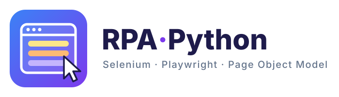
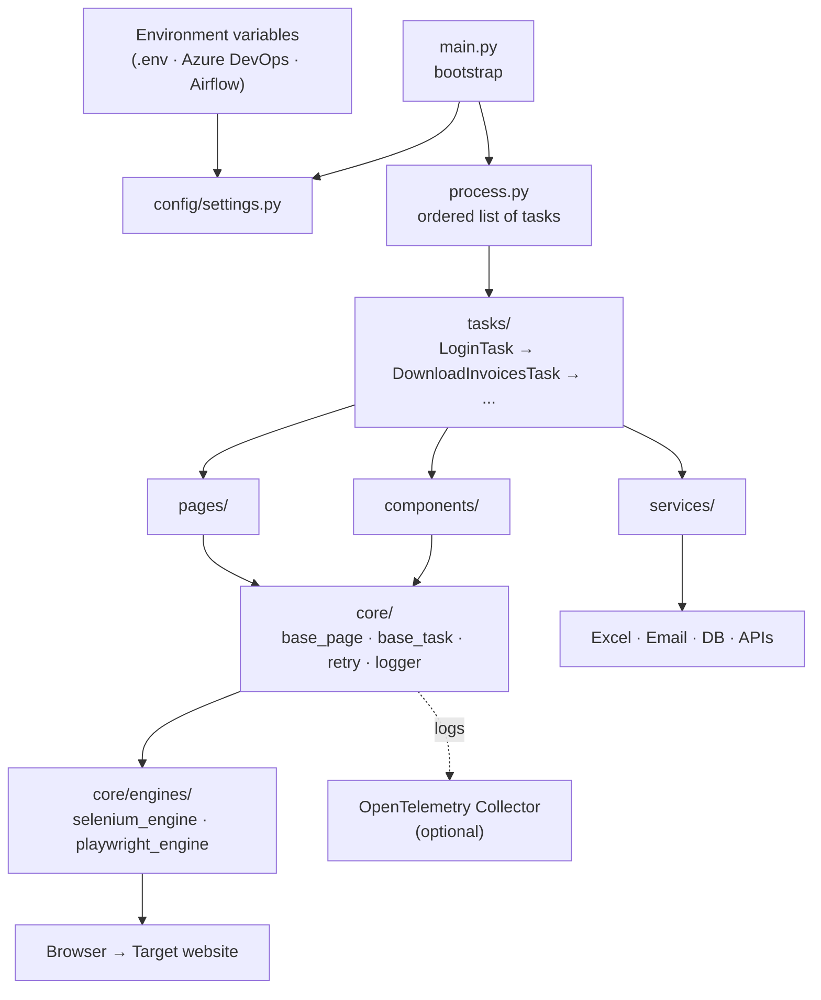

<p align="center">
  <picture>
    <source media="(prefers-color-scheme: dark)" srcset="docs/logo-dark.svg">
    
  </picture>
</p>

<p align="center">
  
  
  
  
  
  
</p>

# rpa-&lt;process-name&gt;

Reference template for building **web RPA bots in Python** with **Selenium** or **Playwright**.

It defines one standard for:
- the folder structure,
- the layering rules,
- the naming conventions,
- error handling, retries and logging.

Both people and AI agents can follow the same standard.

> **One repo = one bot = one end-to-end business process.**
> The bot is built for that process, and the process is split into **tasks** (ordered steps).

---

## Table of contents

- [Why this template](#why-this-template)
- [Architecture](#architecture)
- [Folder structure](#folder-structure)
- [Layering rules](#layering-rules)
- [Naming conventions](#naming-conventions)
- [Error handling and retries](#error-handling-and-retries)
- [Logging and OpenTelemetry](#logging-and-opentelemetry)
- [Quick start](#quick-start)
- [Switching engines](#switching-engines)
- [Running in Azure DevOps and Airflow](#running-in-azure-devops-and-airflow)
- [How to add a new screen](#how-to-add-a-new-screen)
- [How to add a new task](#how-to-add-a-new-task)
- [Working with AI agents](#working-with-ai-agents)

---

## Why this template

RPA scripts tend to start as one long file full of selectors, `time.sleep()` calls and copy-pasted logins. They work until the website changes, and then nobody knows where to fix them.

This template applies the **Page Object Model** (POM) to RPA. It separates:

- **what** the bot does: tasks, the business process;
- **where** it does it: pages, the screens of the website;
- **how** it talks to the browser: core and engines, Selenium or Playwright.

When the website changes, you fix one page. When you change browser engine, you touch nothing outside `core/engines/`.

---

## Architecture

The editable diagram lives in [`docs/architecture.drawio`](docs/architecture.drawio). Open it with [diagrams.net](https://app.diagrams.net) or with the Draw.io extension for VS Code.



---

## Folder structure

```
rpa-<process-name>/
├── AGENTS.md                # rules for AI agents (source of truth)
├── CLAUDE.md                # points to AGENTS.md
├── README.md
├── .env.example             # all env vars, no real values
├── .gitignore
├── requirements.txt
├── pytest.ini               # pytest config (import path, e2e marker)
├── main.py                  # bootstrap: settings, logging, engine → runs the process
├── process.py               # the end-to-end process: ordered list of tasks
│
├── config/
│   └── settings.py          # reads env vars into a typed settings object
│
├── core/                    # technical layer, knows nothing about the business
│   ├── engines/
│   │   ├── base_engine.py       # abstract contract every engine implements
│   │   ├── selenium_engine.py
│   │   ├── playwright_engine.py
│   │   └── engine_factory.py    # picks the engine from RPA_ENGINE
│   ├── base_page.py
│   ├── base_task.py         # retries, timing, logging, screenshots
│   ├── context.py           # data shared between tasks
│   ├── retry.py
│   ├── logger.py
│   └── exceptions.py        # BusinessException, SystemException
│
├── pages/                   # one class per web screen
├── components/              # UI pieces reused across screens
├── tasks/                   # steps of the process
├── services/                # Excel, email, DB, APIs (no browser)
│
├── data/
│   ├── input/               # files the bot consumes
│   └── output/              # files the bot produces
├── evidence/                # screenshots
├── logs/
├── tests/                   # unit, architecture and e2e tests
├── deploy/
│   ├── azure-pipelines.yml
│   └── airflow_dag_example.py
└── docs/
    ├── architecture.drawio
    ├── logo.svg             # logo for light backgrounds
    └── logo-dark.svg        # logo for dark backgrounds
```

| Folder | What goes here | What never goes here |
|---|---|---|
| `core/` | Browser engines, base classes, retries, logging | Business logic, locators of a specific site |
| `pages/` | Locators and actions of one screen | Calls to other pages, business decisions |
| `components/` | Menus, tables, modals, paginators used on several screens | Screen-specific logic |
| `tasks/` | One step of the business process | Locators, direct browser calls |
| `services/` | Everything outside the browser | Selenium / Playwright imports |
| `process.py` | The order of the tasks | Implementation details |

---

## Layering rules

```
main.py → process.py → tasks/ → pages/ + components/ + services/ → core/
```

1. Dependencies only point **down**. A lower layer never imports an upper one.
2. **Tasks never contain locators.** They only call methods of pages, components and services.
3. **Pages never call other pages** and never contain business logic. They return data, and tasks decide what to do with it.
4. **Only `core/engines/`** imports `selenium` or `playwright`.
5. Tasks communicate only through the shared **`context`** object, never through globals.
6. **`process.py` defines the order** of the tasks. File names are not numbered.

---

## Naming conventions

Everything is in **English**: code, comments, docs and file names.

### Files and classes

| Element | File | Class |
|---|---|---|
| Page | `login_page.py` | `LoginPage` |
| Component | `results_table_component.py` | `ResultsTableComponent` |
| Task | `download_invoices_task.py` | `DownloadInvoicesTask` |
| Service | `excel_service.py` | `ExcelService` |

### Methods and variables

- Every task exposes a single public method: `run(context) -> context`.
- Method names are a verb plus an object: `fill_username()`, `click_login()`, `get_invoice_total()`.
- Methods that return a boolean start with `is_`, `has_` or `can_`: `is_logged_in()`, `has_results()`.
- No abbreviations: `start_date`, never `st_dt`.
- Lists are plural and items singular: `for invoice in invoices`.
- Constants and locators use `UPPER_SNAKE_CASE`.

### Locator prefixes

| Prefix | Element | Example |
|---|---|---|
| `BTN_` | Button | `BTN_LOGIN` |
| `TXT_` | Text input | `TXT_USERNAME` |
| `LBL_` | Label / text | `LBL_ERROR_MESSAGE` |
| `LNK_` | Link | `LNK_FORGOT_PASSWORD` |
| `CHK_` | Checkbox | `CHK_REMEMBER_ME` |
| `RDO_` | Radio button | `RDO_PAYMENT_CASH` |
| `DDL_` | Dropdown | `DDL_DOCUMENT_TYPE` |
| `TBL_` | Table | `TBL_INVOICES` |
| `MDL_` | Modal / popup | `MDL_CONFIRMATION` |
| `IFR_` | Iframe | `IFR_PAYMENT_FORM` |

### Locator format

The same locator must work with both engines:

- Locators are plain strings, **CSS by default**.
- Use XPath only when unavoidable, with the `xpath=` prefix: `"xpath=//td[text()='Total']/following-sibling::td"`.
- Priority: `id` → `data-testid` → `name` → CSS → relative XPath.
- **Never use absolute XPath** (`/html/body/div[3]/...`).
- **Never use `time.sleep()`.** Always use the engine's explicit waits.

### Example

Pages reach the browser only through the protected helpers of `BasePage` (`_fill`, `_click`, `_wait_for`, ...).

```python
# pages/login_page.py
from core.base_page import BasePage


class LoginPage(BasePage):
    URL_PATH = "/login"

    TXT_USERNAME = "#username"
    TXT_PASSWORD = "#password"
    BTN_LOGIN = "button[type='submit']"
    LBL_FLASH_MESSAGE = "#flash"
    LBL_FLASH_SUCCESS = "#flash.success"
    LNK_LOGOUT = "xpath=//a[contains(@href, '/logout')]"

    def open_login(self) -> None:
        self._open_path(self.URL_PATH)
        self._wait_for(self.TXT_USERNAME)

    def fill_username(self, username: str) -> None:
        self._fill(self.TXT_USERNAME, username)

    def fill_password(self, password: str) -> None:
        self._fill(self.TXT_PASSWORD, password)

    def click_login(self) -> None:
        self._click(self.BTN_LOGIN)

    def wait_for_flash_message(self) -> None:
        self._wait_for(self.LBL_FLASH_MESSAGE)

    def is_logged_in(self) -> bool:
        return self._is_visible(self.LBL_FLASH_SUCCESS)

    def get_flash_message(self) -> str:
        return self._get_text(self.LBL_FLASH_MESSAGE).rstrip("×").strip()
```

Tasks implement `execute(context)`. The public `run(context) -> context` is inherited from `BaseTask`, which wraps it with retries, timing, logs and screenshots.

```python
# tasks/login_task.py
from core.base_task import BaseTask
from core.context import ProcessContext
from core.exceptions import BusinessException
from pages.login_page import LoginPage


class LoginTask(BaseTask):
    STOP_ON_BUSINESS_ERROR = True

    def execute(self, context: ProcessContext) -> None:
        login_page = LoginPage(self._engine, self._settings.base_url)

        login_page.open_login()  # always start from a known screen: retries are safe
        login_page.fill_username(self._settings.username)
        login_page.fill_password(self._settings.password)
        login_page.click_login()
        login_page.wait_for_flash_message()

        if not login_page.is_logged_in():
            raise BusinessException(f"Login rejected: {login_page.get_flash_message()}")

        context.is_logged_in = True
```

### Environment variables and output files

| Item | Convention |
|---|---|
| Env vars | `RPA_` prefix (`RPA_BASE_URL`, `RPA_TIMEOUT_SECONDS`), except `OTEL_*` |
| Output files | `<process>_<YYYYMMDD_HHMMSS>.<ext>` |
| Screenshots | `<task>_attempt<n>_<YYYYMMDD_HHMMSS>.png` |
| Log files | `<process>_<YYYYMMDD>.log` |

---

## Error handling and retries

| Exception | When | Retried? |
|---|---|---|
| `SystemException` | Timeout, element not found, site down, network error | **Yes**, up to `RPA_MAX_RETRIES` (default **3**) |
| `BusinessException` | Invalid data, record not found, business rule failed | **No**. The error is logged and the process stops, or the task is skipped if `STOP_ON_BUSINESS_ERROR = False` |

Retrying a technical error makes sense, because the site may just be slow. Retrying "supplier does not exist" three times does not.

On every failed attempt, `BaseTask` automatically:

1. saves a screenshot to `evidence/`,
2. writes a structured log entry,
3. retries the task from the start (only for `SystemException`). There is no sleep between attempts: the engines' explicit waits handle slow pages.

Any unexpected exception is treated as a `SystemException`, so it is retried too.

The browser is always closed in a `finally` block.

---

## Logging and OpenTelemetry

Every log entry carries these structured fields:

| Field | Example |
|---|---|
| `process_name` | `sample_login` |
| `task` | `login_task` |
| `attempt` | `2` |
| `status` | `started` · `succeeded` · `failed` · `retrying` |
| `duration_ms` | `1843` |

On failures, entries also carry `error_type` and `screenshot`.

> The field is `process_name` and not `process` because `process` is a reserved attribute of Python's `LogRecord` (the OS process id): `logging` rejects it in `extra=` and OpenTelemetry would drop it.

Logs go to the console and to `logs/<process>_<YYYYMMDD>.log`:

```
2026-10-03 06:00:01,120 INFO     core.base_task - Task attempt started | process_name=sample_login task=login_task attempt=1 status=started
```

 **OpenTelemetry is optional and needs no code changes:**

```bash
pip install opentelemetry-distro opentelemetry-exporter-otlp

export OTEL_SERVICE_NAME=rpa-download-invoices
export OTEL_EXPORTER_OTLP_ENDPOINT=http://localhost:4317
export OTEL_PYTHON_LOGGING_AUTO_INSTRUMENTATION_ENABLED=true

opentelemetry-instrument python main.py
```

Without those variables, the bot runs exactly the same, with logs only to the console and files.

---

## Quick start

```bash
git clone https://github.com/<user>/rpa-<process-name>.git
cd rpa-<process-name>

python -m venv .venv
source .venv/bin/activate        # Windows: .venv\Scripts\activate
pip install -r requirements.txt
python -m playwright install chromium   # only if you use Playwright

cp .env.example .env             # fill in your values
python main.py
```

Run the tests:

```bash
pytest                 # everything; e2e tests run once per engine (headless)
pytest -m "not e2e"    # offline: unit + architecture tests, no browser
```

If an engine library is not installed, its e2e tests are skipped.

---

## Switching engines

```bash
RPA_ENGINE=selenium python main.py
RPA_ENGINE=playwright python main.py

# PowerShell
$env:RPA_ENGINE="playwright"; python main.py
```

Real environment variables override the values in `.env`.

Pages, components, tasks and services do not change. Only `core/engines/` knows which engine is running.

---

## Running in Azure DevOps and Airflow

The code **only reads environment variables**. Where they come from depends on where the bot runs:

| Where | Secrets come from |
|---|---|
| Local | `.env` file (never committed) |
| Azure DevOps | *Variable Groups* linked to **Azure Key Vault**, mapped to env vars in the step's `env:` block (secrets are not exposed automatically) |
| Airflow | *Connections* / *Variables*, passed as env vars by the DAG |

See the examples in [`deploy/azure-pipelines.yml`](deploy/azure-pipelines.yml) and [`deploy/airflow_dag_example.py`](deploy/airflow_dag_example.py).

> **Note:** an *RPA task* (a step of this bot, in `tasks/`) is **not** the same as an *Airflow task* (a node of a DAG). Usually one Airflow task runs the whole bot (`python main.py`), which in turn runs all its RPA tasks.

---

## How to add a new screen

1. Create `pages/<screen_name>_page.py` with a `<ScreenName>Page` class that inherits from `BasePage`.
2. Declare the locators as prefixed constants (`BTN_`, `TXT_`, ...).
3. Add action methods (verb plus object) and query methods (`is_` / `has_` / `get_`), using only the protected helpers of `BasePage`.
4. If a piece of UI repeats on several screens, move it to `components/`.

## How to add a new task

1. Create `tasks/<action>_task.py` with a `<Action>Task` class that inherits from `BaseTask`.
2. Implement `execute(context) -> None` using pages, components and services only. Start from a known screen so a retry is safe, and store results as typed fields on `ProcessContext` (`core/context.py`).
3. Raise `BusinessException` for business errors. Let technical errors surface as `SystemException`.
4. Add the task to `PROCESS_TASKS` in `process.py`, in its place in the sequence.
5. Add any new env var to `.env.example` and `config/settings.py`.
6. Add tests in `tests/`.

---

## Working with AI agents

[`AGENTS.md`](AGENTS.md) contains these same rules as short, direct instructions for AI coding agents (Claude Code, Cursor, Copilot, Codex...). `CLAUDE.md` just points to it.

Keep both files updated when a convention changes. The agent follows what is written, not what the team agreed on verbally.

---

## License

[MIT](LICENSE)
